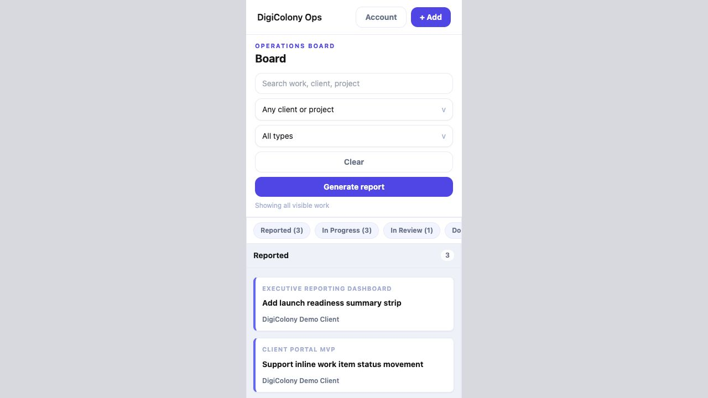
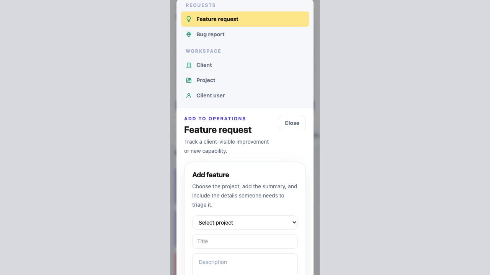
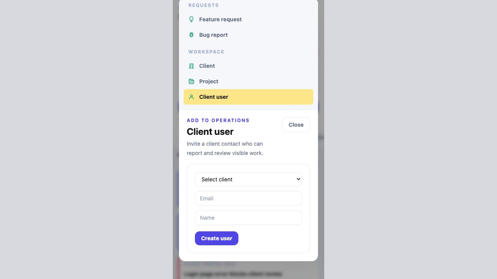

# Mobile Add Modal Audit

## Audit scope

- Surface: admin Add flow at a 390 × 844 mobile viewport.
- Release reviewed: `20260717T122439Z` at `https://portal.digicolony.net`.
- Capture environment: authenticated local mirror of the deployed release at `http://127.0.0.1:3000`, using seeded test credentials so the live admin password and data were not touched.
- Representative states: closed board, long feature-request form, and short client-user form.

## User goal and accessibility target

An admin should be able to choose what to add, understand the selected task, complete the form, and reach the primary action without unnecessary scrolling. The modal should have clear dialog semantics, predictable focus, touch-friendly controls, and resilient mobile reflow.

## Steps and health

1. **Open the board and find Add — Healthy.** The mobile header keeps `+ Add` visible and the button is easy to discover.
2. **Open Add and choose a type — Needs redesign.** All five choices stack above the form, consuming about 280 px before the task begins.
3. **Complete a long request form — Poor.** The title, explanation, and the start of the feature form are visible, but most fields and both actions fall below the first viewport.
4. **Complete a short client-user form — Usable with friction.** The whole form nearly fits, but the chooser still dominates the top third and repeats context the user no longer needs.

## Strengths

- The global `+ Add` entry point remains visible in the mobile header.
- Type labels and icons are clear, and the selected yellow state is easy to distinguish.
- Form controls stay within the viewport width with consistent padding and no horizontal overflow.
- The short client-user flow keeps its primary action visible in the first viewport.

## UX risks

1. **The modal combines two steps on one small screen.** The persistent type chooser competes with the active form after the user has already made a selection.
2. **Long forms hide the outcome.** In the feature-request state, users cannot see the final fields, Cancel, or Create without substantial scrolling, so the screen gives no early sense of task length or completion.
3. **Context is repeated.** The selected row, `Add to operations`, the task title, its description, and the form title all repeat the same decision before the first field.
4. **Scrolling behavior is harder than necessary.** The desktop modal keeps its max-height and internal overflow model on mobile, creating a tall stacked surface rather than a purpose-built full-screen flow.
5. **Close is visually secondary but structurally detached.** It sits beside the title after the large chooser, rather than in a stable mobile header that remains available while scrolling.

## Accessibility risks

- The captured semantic tree does not expose a `dialog` role or `aria-modal`; assistive technology may not understand that focus has moved into a modal task.
- The code path needs explicit verification for initial focus, focus trapping, Escape behavior, and returning focus to `+ Add` after close.
- Menu rows appear close to, but may be below, a 44 px touch target; measure the rendered hit area during implementation.
- The primary action for long forms is not visible without scrolling, which increases effort for keyboard, switch, zoom, and motor-impaired users.
- Screenshot evidence cannot confirm contrast ratios, screen-reader announcements, keyboard order, soft-keyboard behavior, or safe-area handling.

## Recommended mobile model

Use a two-step full-screen flow below the desktop breakpoint:

1. **Step 1: Choose what to add.** Show a full-screen sheet with a compact header (`Add`, Close) and the five 44–48 px choices. Selecting a type advances immediately.
2. **Step 2: Complete the form.** Replace the chooser with a sticky header containing Back, the chosen type and icon, and Close. Show only the form below it.
3. **Keep actions reachable.** Put Cancel/Create in a sticky bottom action bar for long request forms, respecting mobile safe-area padding.
4. **Remove repeated copy.** Keep one short task description at most; do not repeat the selected type in both a menu row and multiple headings.
5. **Use real dialog behavior.** Add `role="dialog"`, `aria-modal="true"`, a labelled heading, initial focus, a focus trap, Escape handling, and focus restoration.

Desktop can retain the current side-by-side chooser and form because the available width makes simultaneous context useful.

## Evidence

### 1. Mobile board before Add

### 2. Long feature-request form

### 3. Short client-user form

## Evidence limits

This was a combined screenshot and semantic-structure audit. It did not claim WCAG compliance and did not test a physical phone, screen reader, mobile soft keyboard, orientation changes, browser chrome, or safe-area insets.
